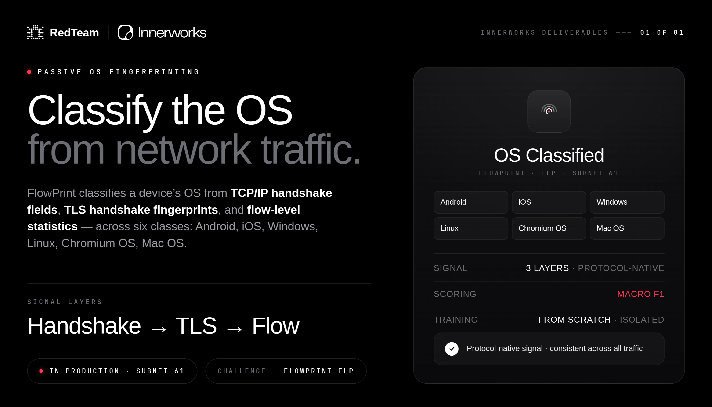

# FlowPrint OS Classification Challenge



## Overview

FlowPrint is a network-flow classification challenge for identifying device OS.
It uses the same two-stage submission model as FlowRadar:

1. Train a model from the mandatory production training dataset.
2. Use the generated model to classify production test flows.

Miners submit two Python files through `miner_output.commit_files`:

- `train.py`
- `submissions.py`

The challenge runs both files inside an isolated FlowPrint container. Miner
Python is never executed by the main challenge API process.

## Production Data

- Training: `v1_train_data.csv`
    - label: `device_os`
    - classes: `Android`, `iOS`, `Windows`, `Linux`, `Chromium OS`, `Mac OS`
- Scoring: `v1_test_data.csv`
    - same v1 schema
    - available only inside the official scoring server

The production training dataset is mandatory. Miners cannot replace it or
select another training file. The test dataset is not published for miners,
including for local testing, for security reasons.

## Submission Shape

```json
{
  "miner_output": {
    "commit_files": [
      {"file_name": "train.py", "content": "..."},
      {"file_name": "submissions.py", "content": "..."}
    ]
  }
}
```

Exactly these two files are required. Duplicate names, additional files,
path-based names, and empty content are rejected.

Embedding pretrained or externally generated learned weights in either file is
prohibited. Every model must be trained from `v1_train_data.csv` during the
current scoring run.

## Challenge Flow

1. The challenge receives `train.py` and `submissions.py`.
2. It starts an isolated FlowPrint container.
3. Both files and `v1_train_data.csv` are mounted read-only.
4. The challenge calls the container's `POST /train` endpoint.
5. `train.py` writes a temporary JSON model.
6. The official scorer replays private `v1_test_data.csv` rows through
   `/os_detector`.
7. `submissions.py` returns one OS class prediction per flow.
8. The final score is calculated using macro F1 across OS classes.

## Emission Requirement

FlowPrint requires a minimum score of `0.9` for emission eligibility. Scores
below `0.9` do not receive emission.

## Challenge Versions

- [v1 (Active)](./v1.md)

## Resources

- [FlowPrint v1 Testing Manual](./testing_manuals.md)
- [Building a Submission Commit](../../miner/workflow/3.build-and-publish.md)
- [Dashboard](../../miner/concepts/dashboard.md)

## References

- RedTeam Subnet: <https://www.theredteam.io>
- FlowPrint repository: <https://github.com/RedTeamSubnet/flowprint_v1>
- Docker: <https://docs.docker.com>
