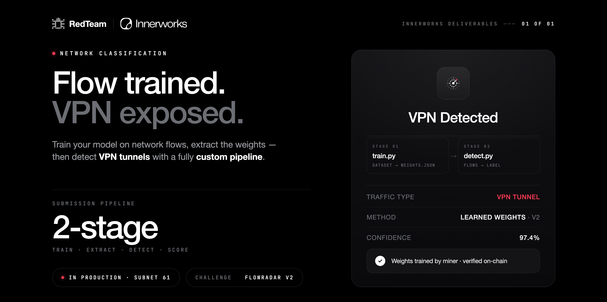

# FlowRadar VPN Detection Challenge



## Overview

FlowRadar is a network-flow classification challenge for detecting VPN
traffic. FlowRadar v2 introduces a two-stage miner pipeline:

1. Train a model from the mandatory production training dataset.
2. Use the generated model to classify production test flows.

Miners submit two Python files through `miner_output.commit_files`:

- `train.py`
- `submissions.py`

The challenge runs both files inside an isolated FlowRadar container. Miner
Python is never executed by the main challenge API process.

## Production Data

- Training: `v2_train_data.csv`
  - 100,000 rows
  - 110 columns
  - label: `vpn_is_enabled`
- Scoring: `v2_test_data.csv`
  - 400,000 rows
  - same v2 schema

The production training dataset is mandatory. Miners cannot replace it or
select another training file.

## Submission Shape

```json
{
  "miner_output": {
    "commit_files": [
      {"file_name": "train.py", "content": "..."},
      {"file_name": "submissions.py", "content": "..."}
    ]
  }
}
```

Exactly these two files are required. Duplicate names, additional files,
path-based names, and empty content are rejected.

## Challenge Flow

1. The challenge receives `train.py` and `submissions.py`.
2. It starts an isolated FlowRadar container.
3. Both files and `v2_train_data.csv` are mounted read-only.
4. The challenge calls the container's `POST /train` endpoint.
5. `train.py` writes a temporary JSON model.
6. The challenge replays `v2_test_data.csv` through `/vpn_detector`.
7. `submissions.py` returns one boolean prediction per flow.
8. The final score is calculated using F1.

## Challenge Versions

- [v2 (Active)](./v2.md)
- [v1 (Deprecated)](./v1.md)

## Resources

- [FlowRadar v2 Testing Manual](./testing_manuals.md)
- [Building a Submission Commit](../../miner/workflow/3.build-and-publish.md)
- [Dashboard](../../miner/concepts/dashboard.md)

## References

- RedTeam Subnet: <https://www.theredteam.io>
- FlowRadar repository: <https://github.com/RedTeamSubnet/flowradar-challenge>
- Docker: <https://docs.docker.com>
