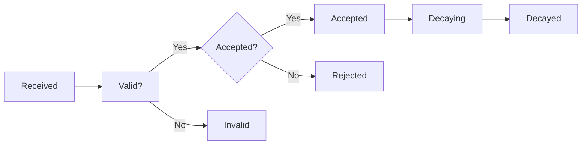

# Dashboard

## Overview

The Dashboard is a comprehensive monitoring and analytics interface that provides real-time visibility into your submission lifecycle, scoring progress, and detailed performance metrics. It displays all your commits throughout their evaluation process and offers transparency into validation, comparison, and scoring results.

### Quick Reference: What You'll See

| Component | Purpose |
| --------- | ------- |
| **Miner Statistics** | Shows your average score, total submissions, and best score at a glance |
| **Commit History Table** | Lists all your submissions with detailed information about each one |
| **Status Column** | Shows where each submission is in the evaluation pipeline |
| **Score Columns** | Display raw score, penalties, and final score after all adjustments |
| **Payload Columns** | Provide detailed debugging info: validation results, comparison data, and scoring breakdown |

### Understanding Your Scores

- **Score**: Raw performance score (0.0 - 1.0) based on how well your submission solved the challenge. Higher is better.
- **Penalty**: The highest similarity score from plagiarism detection. This represents how similar your code is to other submissions (0.0 = completely unique, 1.0 = identical).
- **Final Score**: Your score after applying penalty deductions using a scoring algorithm, then adjusted over time by decay.

!!! tip "Interpreting Penalties"
    Penalties come from code similarity with other submissions. Higher penalty values (closer to 1.0) indicate your code is very similar to others. To reduce penalties, make your solution more unique and original. Check the "Comparison Logs" to see which submissions were compared to yours and their similarity scores.

## Dashboard Features

### Miner Statistics

The dashboard displays key performance metrics at a glance:

- **Average Score**: Calculated mean of all scored submissions
- **Total Submissions**: Total number of commits pushed across all challenges
- **Best Score**: Highest score achieved among your submissions

These metrics update automatically as new submissions are scored and help you track your overall performance.

### Commit History Table

The commit history table displays all your submissions in detail. Click on any row to explore deeper information about your submission, including validation results, comparison analysis, and scoring breakdown.

#### Column Reference

The following columns provide comprehensive information about each of your submissions:

##### Identification & Tracking

- **Miner UID**: Submitted miner's UID on the network.
- **Image Digest**: A unique identifier (hash) of your Docker image.
- **Commit Time**: When you submitted your code to the system. This marks the official timestamp of your submission.
- **Scored Time**: Indicates the time when the submission was evaluated and received a score.

##### Scoring & Performance

- **Score**: The raw performance score your submission received during evaluation (typically 0.0 - 1.0).
- **Penalty**: The highest similarity score detected between your submission and other miners' submissions. This value ranges from 0.0 (completely unique code) to 1.0 (identical code). Higher penalties indicate greater code similarity and will reduce your final score.
- **Final Score**: Miners' actual score after all adjustments, including decay over time. This is what determines your rewards.

##### Status & Notes

- **Status**: The current status of miner's submission in the evaluation process ([Status Lifecycle](#submission-status-lifecycle)).
- **Note**: Additional information from centralized scoring server about your submission, such as failure reasons or special notes.

##### Debug & Transparency Information

These three columns contain detailed JSON data that you can expand by clicking on them:

- **Validation Output**: Result of internal validation checksL
    - Which validation checks passed or failed
    - Details about what was validated
    - Helpful for debugging rejected submissions

- **Comparison Logs**: Reveals how your submission compares to others:
    - Similarity scores against other miners' submissions
    - Reason of similarity scored for each comparison
    - Helps you understand the plagiarism detection results

- **Result JSON**: Detailed scoring results from the evaluation (when available):
    - Breakdown of how your score was calculated
    - Performance metrics from each scoring step
    - Challenge-specific scoring information
    - Only available for challenges that expose detailed scoring data

## Submission Status Lifecycle

Every submission moves through several statuses as it's evaluated and processed. Understanding these statuses helps you track your submission's progress and know what to expect next.

### Status Progression Flow

Your submission typically follows this journey:

### Detailed Status Explanations

#### **Received**

Your submission has just arrived and is waiting to be scored. The system is queuing it for evaluation.

- **What it means**: Your code has been uploaded but not yet tested
- **What to do**: Wait for scoring to complete. This may take a few hours depending on queue load
- **Next step**: Status will change to "Validated" once scoring is done

#### **Validated**

Your submission has been scored and reached to validators for getting an incentive

- **What it means**: Your code has been reached to validators.
- **What to do**: Check your wallet for incentives.
- **Next step**: Status will change to Decaying once the submission's age exceeds 10 days limit

#### **Accepted**

Great! Your submission has been accepted and is eligible for rewards. It passed all acceptance criteria.

- **What it means**: Your submission met all three acceptance criteria:
    - Passed validation checks (Valid)
    - Score exceeded the challenge's minimum acceptable score
    - Penalty (similarity score) is below 0.6 (sufficiently unique)
- **What to do**: Wait till it gets validated status by validators and start earning rewards
- **Next step**: Over time, it will enter "Decaying" status as your submission ages
!!! warning "Important: Submission Override"
    When you submit a new commit, it **immediately replaces** your previous submission. The old submission will no longer earn rewards, even if it was "Accepted". This means you cannot hold multiple active submissions at once. Submit strategically!

#### **Rejected**

Your submission was evaluated but did not meet acceptance criteria.

**Common rejection reasons**:

- **Penalty too high**: Your penalty (similarity score) is 0.6 or higher, indicating your code is too similar to other submissions
- **Score too low**: Your score didn't meet the challenge's minimum acceptable score threshold
- **Failed validation**: Your submission didn't pass all validation checks

**What to do**:

- Check the "Penalty" column - if it's ≥ 0.6, your code needs to be more unique
- Check the "Comparison Logs" to see which submissions yours was similar to
- Review "Validation Output" to ensure all checks passed
- Compare your score against the challenge's minimum requirements

**Next step**: Submit a new, improved version that addresses the rejection reason

#### **Invalid**

Your submission failed a critical validation step and cannot be accepted. This is different from "Rejected" because the submission couldn't even complete validation.

- **What it means**: Your submission has a fundamental issue (broken code, missing files, incompatibility, etc.)
- **What to do**: Check the "Validation Output" column to see exactly what failed. Read the error message carefully and fix the issue
- **Next step**: Submit a corrected version that passes all validation checks

#### **Decaying X%**

Your submission is still earning rewards, but the score is gradually decreasing over time. The percentage shows how much it has decayed so far.

- **What it means**: Your submission is active but older, so its reward value is declining
- **Example**: "Decaying 50%" means your score has lost 50% of its value
- **What to do**: If you're unhappy with the decay rate, submit a new version to potentially earn a higher score
- **Timeline**: Submissions decay over approximately 10-15 days

#### **Decayed**

Your submission has completely decayed and no longer earns any rewards. It's no longer eligible for incentives.

- **What it means**: The full decay period has elapsed since your submission was scored
- **Reward**: $0 - this submission is no longer generating any earnings
- **What to do**: You can view it for historical records, but focus on your non-decayed submissions
- **Next step**: Consider submitting a new version if the challenge is still active

### Understanding Score Decay

!!! info "What is Decay?"
    **Decay** is a time-based reward reduction that encourages continuous improvement. Older submissions gradually lose value to incentivize miners to keep submitting better versions. Think of it like a "freshness bonus" for new submissions.

**Timeline**:

- **Days 0-10**: No decay - your submission earns full value
- **Days 10-15**: Active decay - your score gradually decreases
- **Day 15+**: Fully decayed - your submission earns no rewards

**Why decay matters**:

- Encourages innovation and continuous improvements
- Prevents old, stale submissions from dominating rewards
- Pushes the network toward better security solutions
- Creates opportunity for new miners to compete fairly

## Viewing Your Complete Submission History

The dashboard shows every submission you've ever made for each challenge. This gives you complete transparency into your submission history, including:

- **All Scored Submissions**: Every submission that has been evaluated, with full scores and results
- **Pending Submissions**: Submissions waiting to be scored appear at the top of the list
- **Historical View**: Complete audit trail of your work, showing progression and improvements over time

!!! note "Pending Submissions"
    New submissions that haven't been scored yet appear with an encrypted commit identifier prefixed with `encrypted_commit:` (showing the first 20 characters). Once scoring completes, this will be replaced with the actual commit information and scores.

### When Troubleshooting Issues

1. **Submission stays "Received" too long?** - Check system status or validator messages
2. **Got "Invalid" status?** - Always check "Validation Output" first - it tells you exactly what failed
3. **Score is lower than expected?** - Check "Comparison Logs" to understand the similarity penalties

### Strategic Submission Timing

1. **Understanding the decay window**: You have ~10 days of full reward before decay kicks in
2. **Don't wait until decay**: Continuously improve and submit new versions while your current submission is active
3. **Quality over quantity**: One high-scoring submission beats multiple mediocre ones

!!! warning "Remember These Key Points"
    - **New submissions override old ones**: When you submit, your previous submission stops earning rewards immediately
    - **No reward holds**: You must actively compete - older submissions automatically decay
    - **Validation is strict**: "Invalid" means validation failed; "Rejected" means it passed validation but didn't score high enough
    - **Transparency is key**: Use the payload data to understand why you got your score
