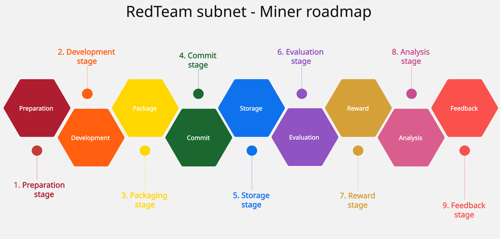
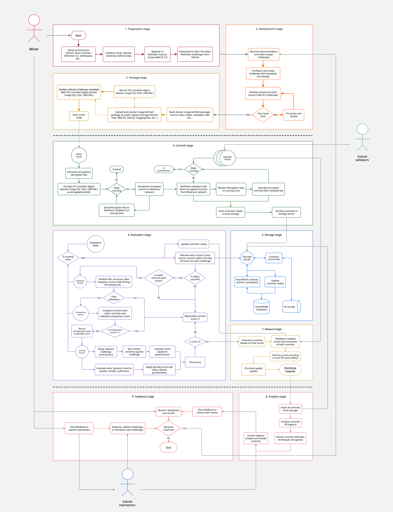
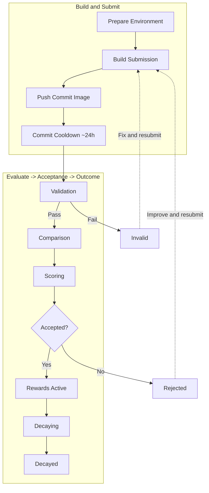

# ♻️ Miner Lifecycle

Miners on RedTeam move through a repeatable loop: prepare environment, build a submission, pass validation/comparison, get scored, and earn rewards until decay. Understanding this lifecycle helps you submit at the right time and avoid avoidable failures.

## Roadmap stages

## Lifecycle

## End-to-End Flow

## Stage-by-Stage

### 1) Prepare Environment

- Set up Docker and registry access (PAT), and keep challenge images under one Docker Hub username.
- Use private repositories to protect your solution.
- References: [Docker Hub Registry & PAT](dockerhubpat.md), [Submission Templates](submission-templates.md).

### 2) Build Submission from Template

- Start from the challenge template and keep fixed files unchanged (`app.py`, `Dockerfile` where required).
- Implement only required files/functions and respect per-challenge limits (file count, line limits, timeouts).
- Reference: [Submission Templates](submission-templates.md).

### 3) Local Pre-Checks

- Run local checks before pushing:
  - ESLint for JavaScript challenges
  - Pylint for Python challenges
  - Ruff checks when the challenge requires `.ruff.toml`
- This is the fastest way to avoid `Invalid` outcomes.
- Reference: [Validation](validation.md).

### 4) Submit and Wait for Cooldown

- Push your commit/image and wait through commit cooldown (~24 hours) before reveal/scoring pipeline runs.
- Limit: one commit per challenge per 24-hour window; latest same-day commit replaces earlier ones.
- Plan timing against the daily incentive cutoff (2:00 PM UTC).
- Reference: [Commit Cooldown & Submission Timing](reveal-interval.md).

### 5) Validation

- System checks file structure, required functions, lint/format compliance, and anti-bypass integrity rules.
- If validation fails, status becomes `Invalid` and scoring stops.
- Reference: [Validation](validation.md).

### 6) Comparison

- Valid submissions are compared against accepted history + same-day submissions.
- Similarity penalties and thresholds are applied (with stricter same-UID handling in many challenges).
- Excessive similarity can skip or heavily penalize your run.
- Reference: [Submission Comparison](comparison.md).

### 7) Scoring and Acceptance

- Challenge logic computes raw score; penalties adjust final score.
- Acceptance typically requires: valid submission, score above challenge threshold, and acceptable similarity.
- Track details in dashboard payload columns (`Validation Output`, `Comparison Logs`, `Result JSON`).
- Reference: [Dashboard](dashboard.md).

### 8) Rewards and Decay

- Accepted submissions become reward-active; emissions are determined through validator weights and Yuma consensus.
- New commits replace previous earning submissions immediately.
- Score value decays over time, so continuous improvement is part of normal strategy.
- References: [Incentive Mechanism](incentive.md), [Dashboard](dashboard.md#submission-status-lifecycle).

## Status Journey You Will See

- Common progression: `Received` -> `Accepted/Rejected/Invalid` -> `Decaying` -> `Decayed`.
- `Invalid` means validation/integrity failure; `Rejected` means scored but did not pass acceptance criteria.
- All statuses and debug payloads are visible in the dashboard history table.
- Reference: [Dashboard Status Lifecycle](dashboard.md#submission-status-lifecycle).

## Practical Operating Routine

1. Build from template and keep fixed files untouched.
2. Run challenge-required lint/format checks locally (including Ruff where required).
3. Push once with your best version for that day.
4. Watch dashboard status/payloads and use failure notes to iterate.
5. Resubmit strategically before heavy decay and before incentive cutoff windows.

## Related Concepts

- [Submission Templates](submission-templates.md)
- [Validation](validation.md)
- [Submission Comparison](comparison.md)
- [Dashboard](dashboard.md)
- [Commit Cooldown & Submission Timing](reveal-interval.md)
- [Incentive Mechanism](incentive.md)
